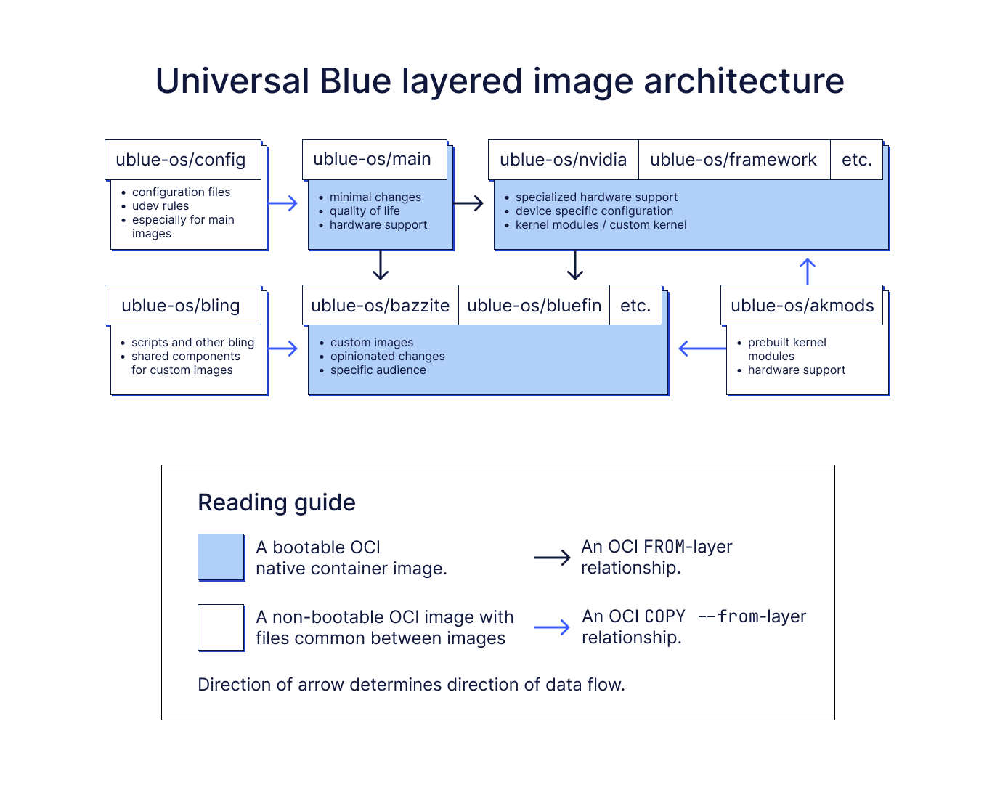

# Architecture

Universal Blue images are based on the `rpm-ostree` native container images hosted at [quay.io](https://quay.io/organization/fedora-ostree-desktops). These are based on the build scripts in this [testing repository](https://gitlab.com/fedora/ostree/ci-test). In the future, Fedora will likely provide the base container images in a more official fashion.

## Main Images

- [ublue-os/config](https://github.com/ublue-os/config) are a collection of `udev` rules and system services used by all Universal Blue images
- [ublue-os/akmods](https://github.com/ublue-os/akmods) kernel modules 
- [ublue-os/main](https://github.com/ublue-os/main) are the main images built from Fedora images 

## Hardware Enablement Images

Images with hardware specific features, built after the main images:

- [ublue-os/nvidia](https://github.com/ublue-os/nvidia) are the same as the main images but include slip-streamed Nvidia drivers
- [ublue-os/asus](https://github.com/ublue-os/asus) - Asus images
- [ublue-os/asus-nvidia](https://github.com/ublue-os/asus-nvidia) - Asus with Nvidia images
- [ublue-os/framework](https://github.com/ublue-os/framework) - Framework images
- [ublue-os/surface](https://github.com/ublue-os/surface) - Surface images
- [ublue-os/surface-nvidia](https://github.com/ublue-os/surface-nvidia) - Surface with Nvidia images

## Opinionated Images 

These tend to have more opinions and are more "end prodcuct" base than base images: 
  
- [Bazzite](https://github.com/ublue-os/bazzite/)
- [Beyond](https://github.com/ublue-os/beyond)
- [Bluefin](https://github.com/ublue-os/bluefin)

## Architecture diagram

### Term explanation

- OCI: [Open Container Initiative](https://opencontainers.org/), an open governance structure and set of standards for Linux containers.
- native container image: a standard OCI image with [ostree native container](https://fedoraproject.org/wiki/Changes/OstreeNativeContainerStable) support.
- OCI `FROM`-layer relationship: a reference to `Containerfile`s where the keyword [`FROM`](https://docs.docker.com/engine/reference/builder/#from) is used to select the base layer image that the new image is going to be built on top of.
- OCI `COPY --from`-layer relationship: a reference to `Containerfile`s where the keyword [`COPY --from`](https://docs.docker.com/build/building/multi-stage/#use-an-external-image-as-a-stage) is used to copy files from the file system of another OCI image.