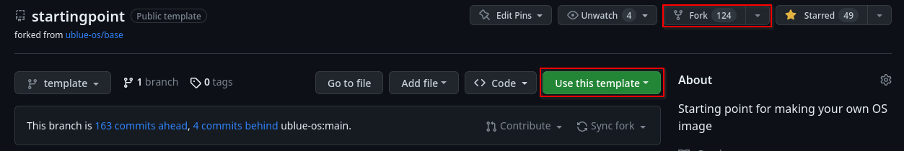
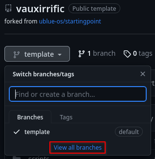
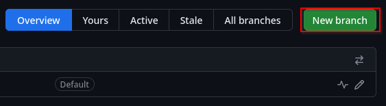
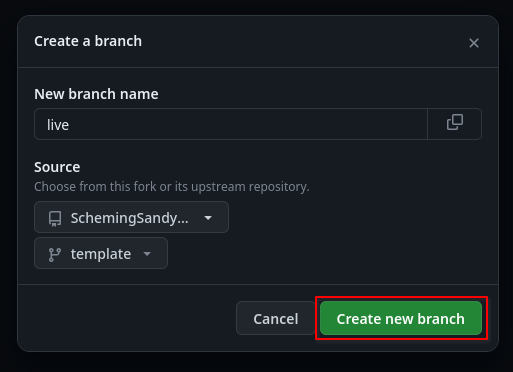
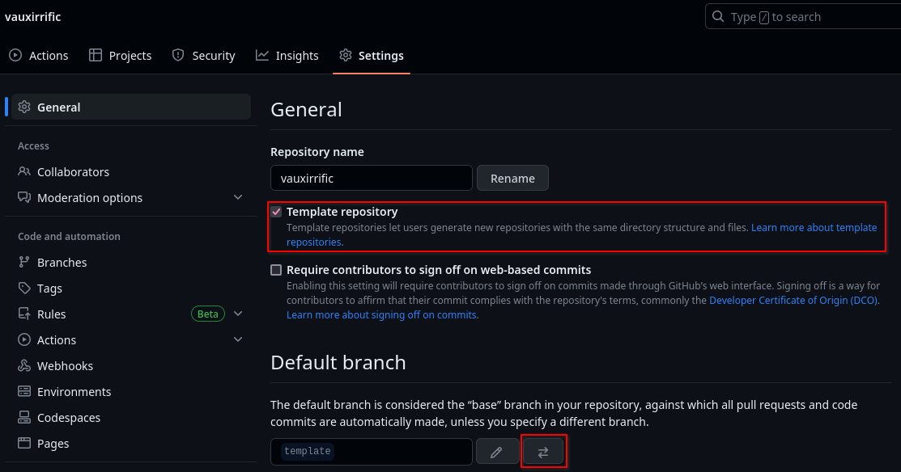
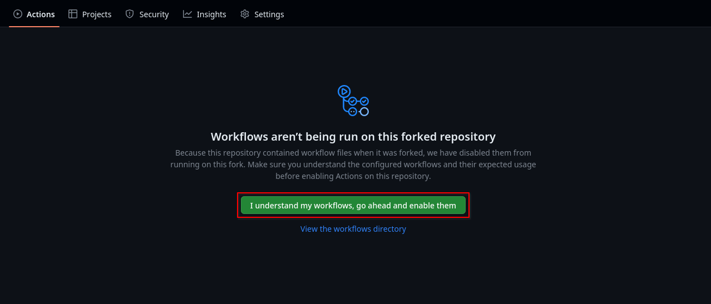
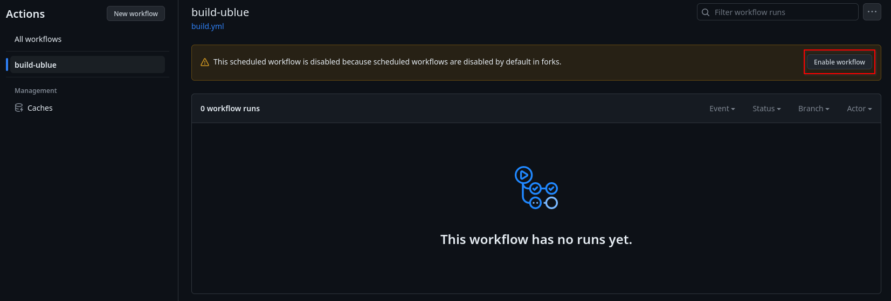

# Manual setup

## Create and configure your repository

### 1. Fork the repository

[Fork](https://docs.github.com/en/get-started/quickstart/fork-a-repo#forking-a-repository) the [ublue-os/startingpoint](https://github.com/ublue-os/startingpoint) repository on GitHub. Forking makes syncing updates from the upstream template to your repository easier.

!!! Note
        GitHub users can only create one fork per repository. You can also "Use this template", but then you'll have to manage syncing with the template yourself.



### 2. Change repository settings on GitHub

Create a new branch called `live` for all your changes. You should never modify the `template` branch. All branches are built to make debugging easier, but only images built from the `live` branch are published.





You should periodically sync changes from `ublue-os/startingpoint:template` into your repo's `template` branch. Then, to get the updates into your customized `live` branch, you can either rebase it on top of `template`, or create a merge-commit with the latest changes from `template`.

In the "Settings" tab of your repository, uncheck "Template repository" and change the default branch to the new `live` branch.


In the "Actions" tab of your repository, enable the workflows.



Optionally, you can install the [Semantic PRs](https://github.com/marketplace/semantic-prs) GitHub app if you want to enforce nice commit messages.

### 3. Set up container signing

!!! Info
        Container signing is important for end-user security and is enabled on all Universal Blue images. It is highly recommended you set this up, and by default the image builds *will fail* if you don't.

This part is important, as users must have a method of verifying the image. The Linux desktop must not lag behind in cloud when it comes to supply chain security, so we're starting right from the start! (Seriously don't skip this part)

!!! warning 
        Be careful to *never* accidentally commit `cosign.key` into your git repo.

1. Install the [cosign CLI tool](https://edu.chainguard.dev/open-source/sigstore/cosign/how-to-install-cosign/)
    - It's recommended you use [a toolbox](https://universal-blue.org/guide/toolbox/).

2. Run:

    ```bash
    cosign generate-key-pair
    ```

    inside your repo folder
    - Do NOT put in a password when it asks you to, just press enter. The signing key will be used in GitHub Actions and will not work if it is encrypted.
  
3. Add the private key to GitHub

    - This can also be done manually. Go to your repository settings, under Secrets and Variables -> Actions
    
    Add a new secret and name it `SIGNING_SECRET`, then paste the contents of `cosign.key` into the secret and save it. Make sure it's the .key file and not the .pub file. Once done, it should look like this:  
    

    - (CLI instructions) If you have the `github-cli` installed, run:
  
    ```bash
    gh secret set SIGNING_SECRET < cosign.key
    ```
  
4. Commit the `cosign.pub` file into your git repository

### 4. Initial modification

Change the image `name:` in [the recipe](https://github.com/ublue-os/startingpoint/blob/template/config/recipe.yml). This is what your image will be called when it's uploaded to your container repository. Your image should start building once the change is committed and pushed.

It is also recommended to change references of `ublue-os/startingpoint` in the `README.md` to your username and image name, change the main title to your images name, and add a short description like "This is my personal image based on Vauxite".
